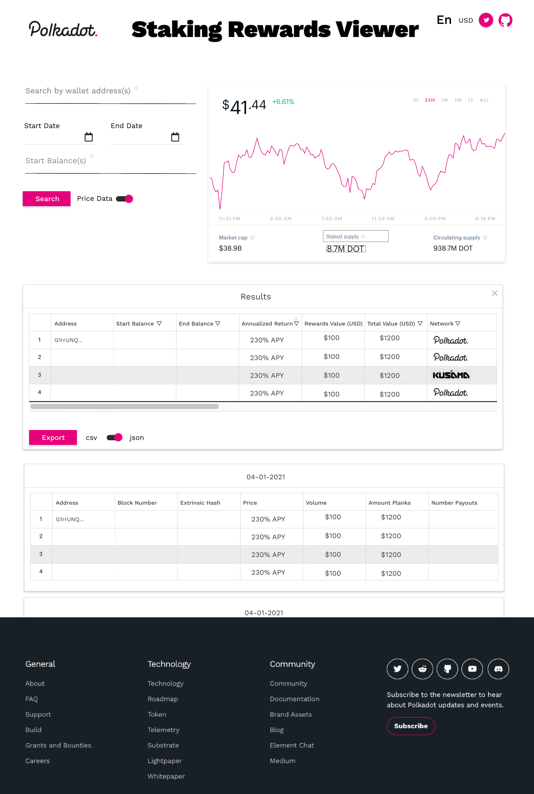

# staking-rewards-viewer

## Project Description :page_facing_up:

This project is a front-end viewer for The [staking-rewards-collector](https://github.com/w3f/staking-rewards-collector). It is an MVP built as a proposal for The [Front-End for Staking Rewards Collector](https://github.com/w3f/General-Grants-Program/blob/master/rfps/staking-rewards-collector-front-end.md) W3F grant propsed by JonasW3F.

## Mockup :crystal_ball:

## Deliverables :nut_and_bolt:
- **Implementation of a user interface**:
  - **Query input parameters (from the users)**:
    - Addresses (multiple ones are supported by the code).
    - Start and end date
    - Does the user want price data linked to staking rewards?
    - What are the startBalances of each address?

  - **Data output viewer**:
    - The code produces a .csv and .json file which should be displayed in the browser.
    - Visualization for the varying number of input addresses.
    - Some sorting based on network / amount.
    - Search for specific entries like dates.
    - Option to download to local storage.
  - **Help page / buttons:**
    - Both the input query and output viewer should have several help buttons to give explanations for all users.

- **Compatibility**:
  - It should be easy to extend the underlying script and the UI should be flexible enough to incorporate that (e.g., adding another column in the data output).
- **Hosting**
    - Centralized and preferably decentralized (IPFS).
- **Testing**
    - Test if the code behaves as expected.
    
## Development Roadmap:
| Number | Deliverable | Specification |
| -----: | ----------- | ------------- |
| 0a. | License | Apache 2.0 / GPLv3 / MIT / Unlicense |
| 0b. | Documentation | We will provide both **inline documentation** of the code and a basic **tutorial** that explains how a user can (for example) spin up one of our Substrate nodes and send test transactions, which will show how the new functionality works. |
| 0c. | Testing Guide | Core functions will be fully covered by unit tests to ensure functionality and robustness. In the guide, we will describe how to run these tests. |
| 0d. | Docker | We will provide a Dockerfile(s) that can be used to test all the functionality delivered with this milestone. |
| 1a. | Address LookUp Functionality | Allow users to enter multiple wallet addresses for either or both the Polkdaot and/or Kusama networks and deploy these features to Vercel. |
| 1b. | CSV/JSON Download | Enable users to download a copy of their lookup results in either CSV or JSON format. |
| 2 | Formvalidation | Add form validation to wallet address input while still allowing for multiple addresses to be entered. Validation for fiat amounts that will properly display based on the selected currency. |
| 3 | Tooltips/Helpers | Create tooltips to explain the different functions that each input of the app has. |
| 4 | Testing | Write tests to confirm the application behaves as expected |
| 5 | IPFS | Create a version of the application that will work on IPFS|
