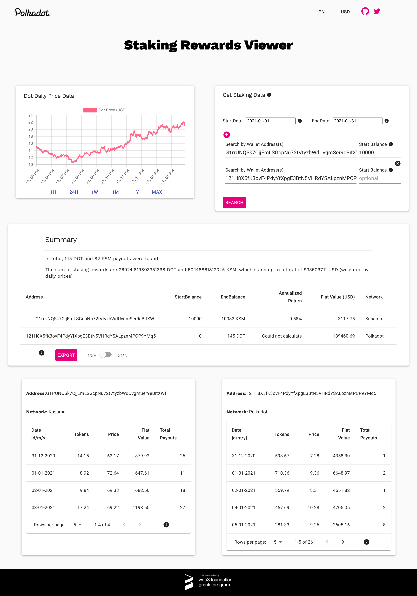
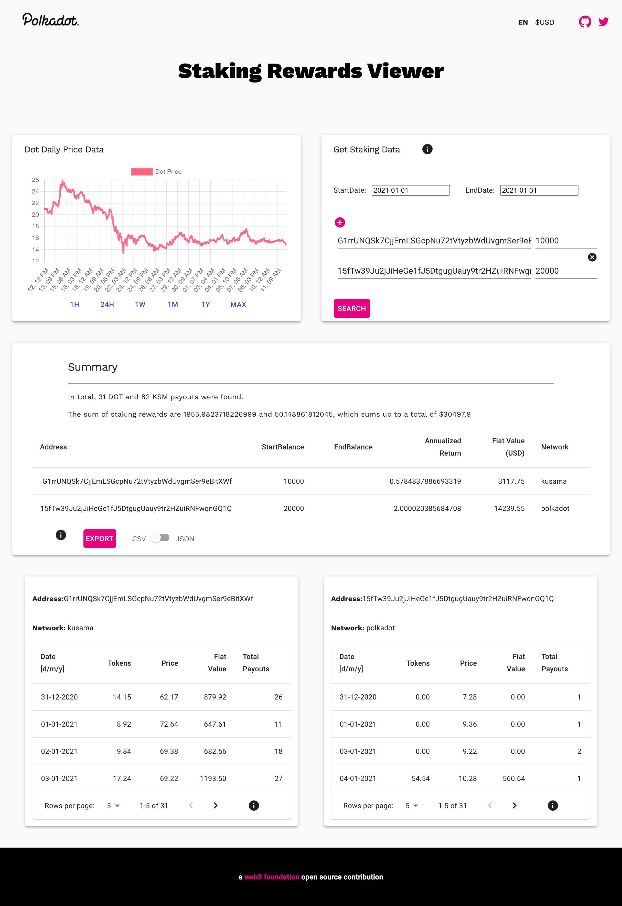

# staking-rewards-viewer
[website](https://staking-rewards-viewer.vercel.app/)

## Project Description :page_facing_up:

This is a Staking Rewards Viewer for Polkadot and Kusama allowing users to view their staking rewards and easily download their search results.
This implementation will take the work started in the [staking-rewards-collector](https://github.com/w3f/staking-rewards-collector) by [jonasW3F](https://github.com/jonasW3F) and refactor it into an easy to use modern front end using Next.js and deployed on Vercel with the goal of deploying to IPFS. This project is fufilling the needs of the Web 3 Foundation grant proposal Front-End for Staking Rewards Collector.


Accepted Grant Proposal: https://github.com/w3f/Open-Grants-Program/blob/master/applications/staking-rewards-collector-front-end.md


## Screenshot :camera: 

## Setup

* Install npm packages using yarn (npm should work, but all development has been done using yarn)
  from src folder run the `yarn` command

* Start the server
```yarn run dev

* Deployment

Follow the [steps](https://nextjs.org/docs/deployment) to deploy a Next.js application to vercel.

## Testing

* After setup run Test Suite using the following Script
```yarn test

* Deployment

Follow the [steps](https://nextjs.org/docs/deployment) to deploy a Next.js application to vercel.

## Mockup :camera:



## Deliverables :nut_and_bolt:
- **Implementation of a user interface**:
  - **Query input parameters (from the users)**:
    - Addresses (multiple ones are supported by the code).
    - Start and end date
    - Does the user want price data linked to staking rewards?
    - What are the startBalances of each address?

  - **Data output viewer**:
    - The code produces a .csv and .json file which should be displayed in the browser.
    - Visualization for the varying number of input addresses.
    - Some sorting based on network / amount.
    - Search for specific entries like dates.
    - Option to download to local storage.
  - **Help page / buttons:**
    - Both the input query and output viewer should have several help buttons to give explanations for all users.

- **Compatibility**:
  - It should be easy to extend the underlying script and the UI should be flexible enough to incorporate that (e.g., adding another column in the data output).
- **Hosting**
    - Centralized and preferably decentralized (IPFS).
- **Testing**
    - Test if the code behaves as expected.

## Development Roadmap :nut_and_bolt:

| Number | Deliverable | Specification |
| -----: | ----------- | ------------- |
| 0a. | License | Apache 2.0 |
| 0b. | Documentation | We will provide both **inline documentation** of the code and a basic **tutorial** that explains how a user can (for example) spin up one of our Substrate nodes and send test transactions, which will show how the new functionality works. |
| 0c. | Testing Guide | Core functions will be fully covered by unit tests to ensure functionality and robustness. In the guide, we will describe how to run these tests. |
| 0d. | Docker | We will provide a Dockerfile(s) that can be used to test all the functionality delivered with this milestone. |
| 1. | UI for user input | Develop an UI to request necessary data from the users. |
| 2a. | Address LookUp Functionality | Allow users to enter multiple wallet addresses for either or both the Polkdaot and/or Kusama networks and deploy these features to Vercel. |
| 2b. | CSV/JSON Download | Enable users to download a copy of their lookup results in either CSV or JSON format. |
| 3. | Form validation | Add form validation to wallet address input while still allowing for multiple addresses to be entered. Validation for fiat amounts that will properly display based on the selected currency. |
| 4.  | UI for data visualizer  | Develop an environment to display the output (.csv and .json) for the end user in a pleasurable way. |
| 5. | Tooltips/Helpers | Implement help texts and tooltips to explain the different features and inputs to users. |
| 6. | Testing | Write tests to confirm the application behaves as expected |
| 7. | Polishing & Delivery | Reach out for feedback to the Grants Team. Integrate final feedback on functional, as well as cosmetic changes like font size, colors, typos etc. |

## Future Plans

* Collaborate with the original RFP proposer to determine how to best promote the finished application throughout the community.
* Ask the community for suggestions to improve and add new features as necesary.
* Refactor and Deploy to IPFS
